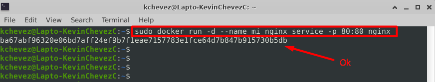

# Tutorial - ¿Cómo crear un contenedor en Linux que incluya el servicio de nginx, usando Docker?


## 1. Conocimientos previos - breve
 * ¿Qué son los contenedores?.
 
 Como bien lo indica (RedHat, 2018)
 >[Son] un conjunto de uno o más procesos separados del resto del sistema. Todos los archivos que se necesitan para ejecutarlos provienen de una imagen diferente, lo cual significa que los contenedores de Linux se pueden trasladar y mantienen la uniformidad desde la etapa de desarrollo hasta las de prueba y producción.
 
 Esto nos indica que su uso agiliza en grandes proporciones la velocidad de uso y consumo de recursos, dejando por debajo la eficiencia en ciertos aspectos de las virtualizaciones de máquinas o sistemas operativos en un computador.
 
 * ¿Qué es Docker?
 
 >Docker es una herramienta, un sistema de administración de contenedores, lanzado oficialmente en 2013. El sistema es extremadamente útil al escalar, actualizar y migrar a otro servidor. - (Coleman, 2020)
 
 Básicamente sirve para crear los contenedores haciendo uso de diferentes imágenes las cuales representan distintos servicios a usar en los sistemas operativos donde se trabajará, estos espacios alojados y considerados como contenedores pueden ser fácilmente configurados a partir de la ejecución de comandos que ayuden en el proceso, siendo así efectivo la creación y alojamiento de subsistemas o servicios que evitan el uso de sus creaciones o usos mediante virtualización y/o máquinas virtuales.
 
 Para más información sobre la documentación de Docker visite el siguiente [enlace🔗](https://docs.docker.com/).
 
 Si desea saber más sobre los comandos que usa Docker en la línea de comandos visite el siguiente [enlace🔗](https://docs.docker.com/engine/reference/commandline/cli/).
 
 * Video referencia Docker y Contenedores.
 
 [](https://www.youtube.com/watch?v=kkfZs0vJFyU)
 
## 2. Tutorial

 Una vez se hayan comprendido los temas anteriormente mencionados e [instalado Docker en Ubuntu (Linux)](https://github.com/KevinChevez/Tutoriales_Ayudantia/tree/main/HowInstallDocker), entonces procedemos con el tutorial el cual puede también ser seguido y revisado en su página oficial mediante el siguiente [enlace🔗](https://hub.docker.com/_/nginx).

 1. Descargar la imagen de NGINX usando Docker mediante la ejecución del siguiente comando:
 ```
 $ sudo docker pull nginx
 ```
 

 2. Una vez descargada la imagen ejecutamos el siguiente comando por consola:
 ```
 $ sudo docker run -d --name mi_nginx_service -p 80:80 nginx
 ```
 
 Siendo el formato de este comando el siguiente: docker run -d(bandera que indica el procesamiento en el background) --name <nombre>(especifica el nombre de tu contenedor a crear) -p <puerto_pc:puerto_container>(Indica el puerto de la computadora y el puerto del contenedor) <Imagen a usar>(En este caso se usó la imagen nginx anteriormente instalada para crear el contenedor satisfactoriamente.)
 
 3. Comprobamos la creación del contenedor usando el siguiente comando:
 ```
 $ sudo docker ps
 ```
 
 
 4. Finalmente si todo salió correctamente comprobamos la existencia del servicio de Nginx en el navegador dentro de nuestro localhost
 

## 3. Referencias
 * Coleman, D. (27 de Abril de 2022). Server space. Recuperado el 25 de Septiembre de 2022, de Qué es Docker?: https://serverspace.io/es/support/help/what-is-docker/
 * Docker. (s.f.). Install Docker Engine on Ubuntu. Recuperado el 25 de September de 2022, de Docker Docs: https://docs.docker.com/engine/install/ubuntu/
 * Red Hat. (31 de Enero de 2018). ¿Qué es un contenedor de Linux? Recuperado el 25 de Septiembre de 2022, de https://www.redhat.com/es/topics/containers/whats-a-linux-container
